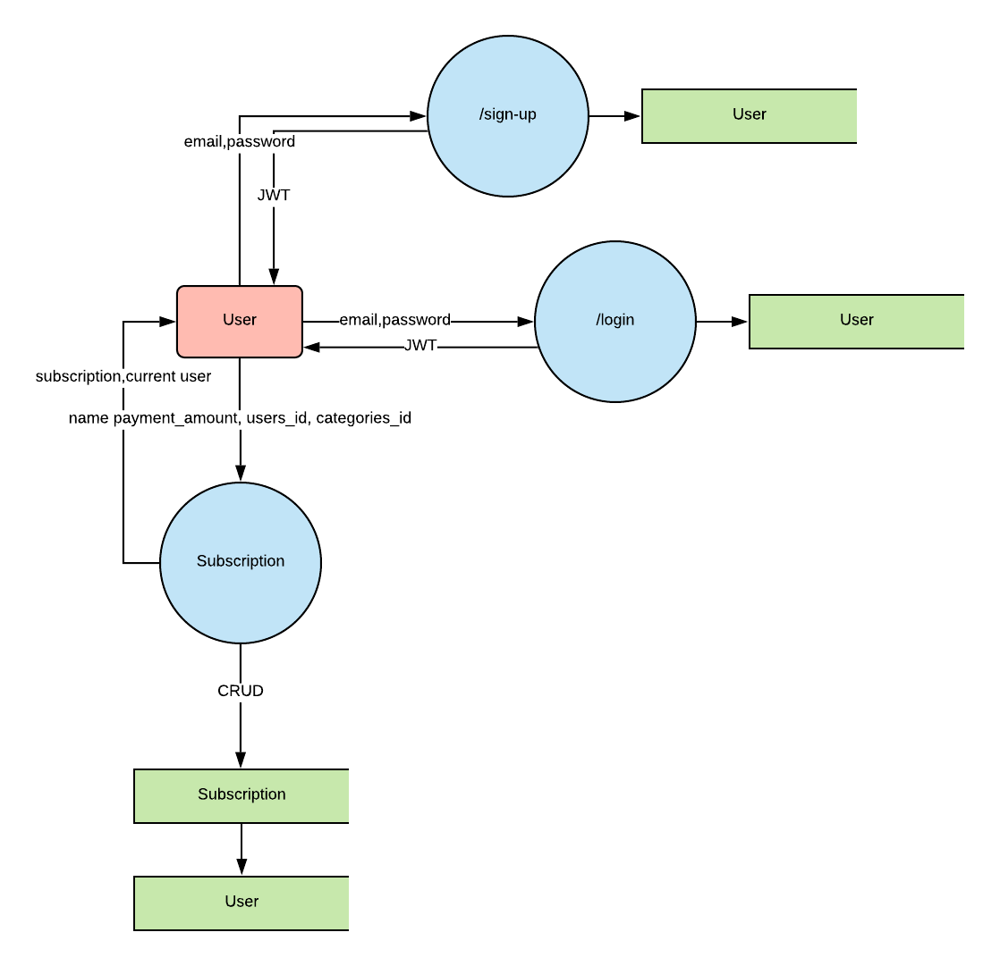
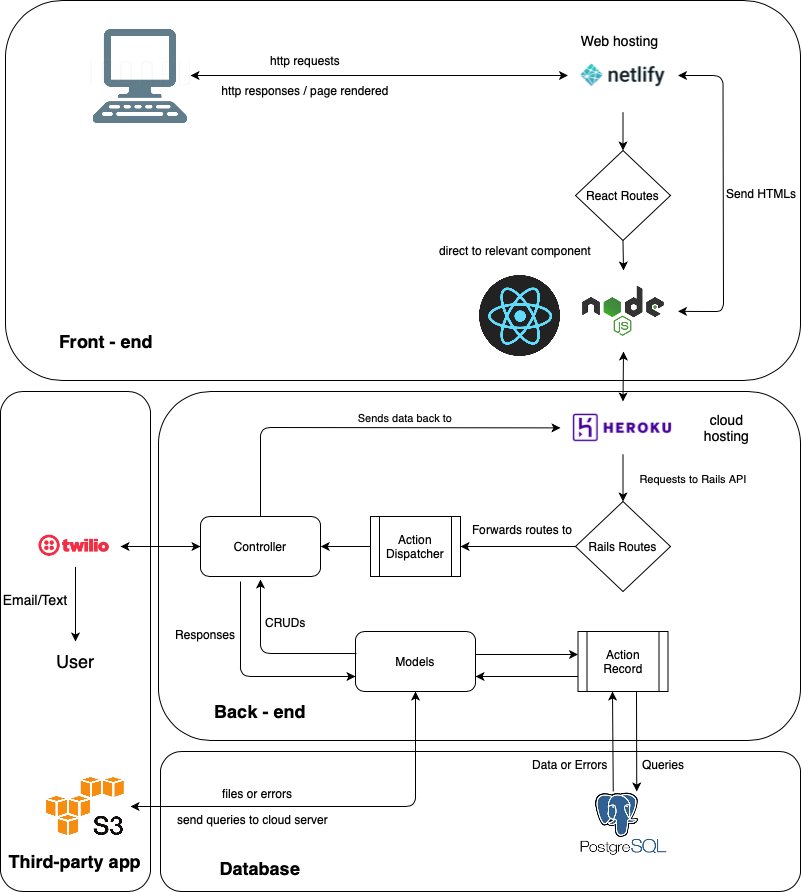
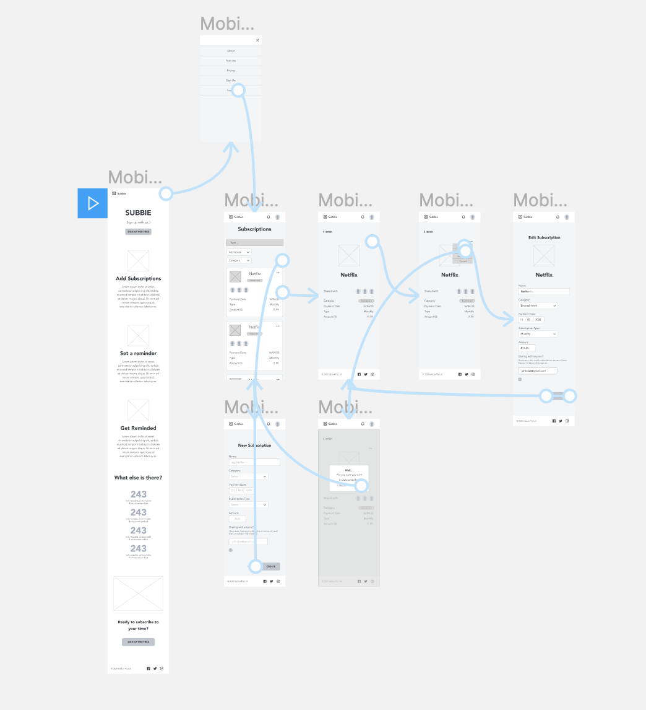
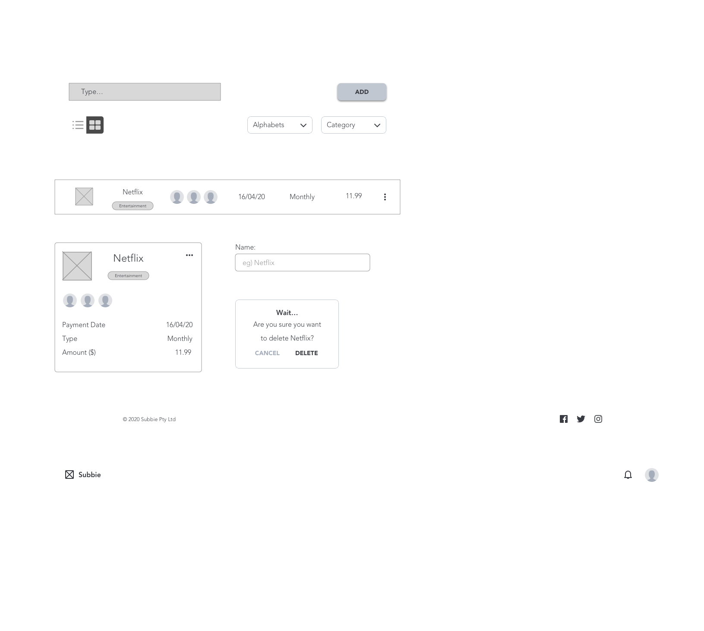
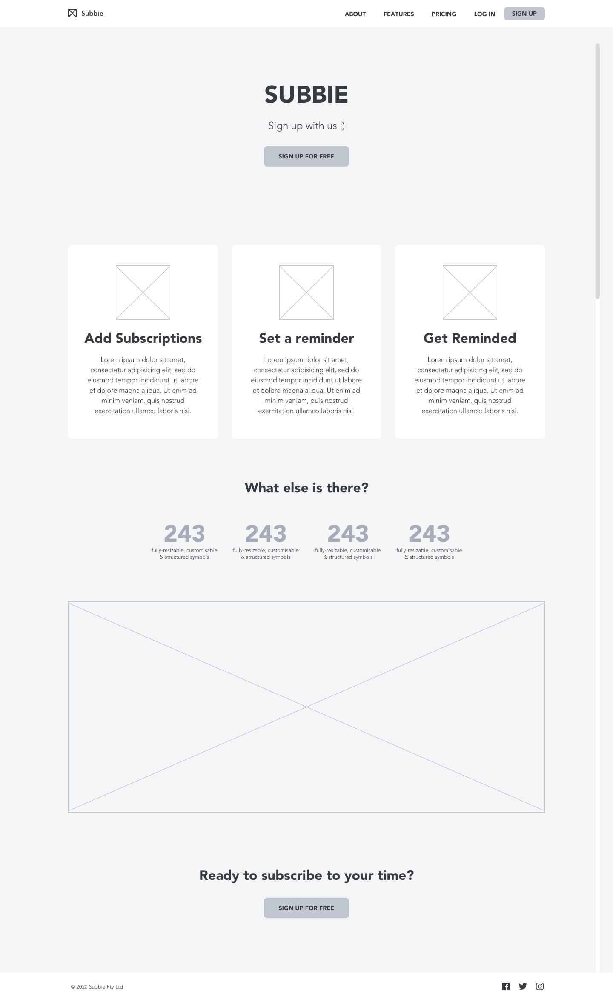

# SUSSCRIBE 

## Brand

- Convenient
- Simple to use
- Quirky and Creative

## Problem statement / Purpose

“We are Susscribe, a subscription management service. Have ever been in a situation where you have too many subscriptions and you lose track of them? Or Have you been paying an unwanted subscription that you’ve forgotten about? Many subscription users who are like you and I, tend to sign up for multiple subscription services and then forget about them due to our busy lifestyle. Susscribe app can manage your subscriptions by keeping them in one centralised platform managed by you.”

## Functionality / Features

### User

**Subscriptions overview**: We provide a clear overview of all your subscriptions and upcoming bills with CRUD functionality

**Payment cycle** : Feel flexible to display your payment cycles per month and year

**Get payment reminder** : get notified by sms or email when a bill is due. 

**Filter** : Filter your subscriptions by category and easily sort subscriptions

**Custom categories** : create custom categories

**Different currencies** : Support many different currencies, you can change the currency you like

**Personalized service** : Change avatar, personal information, friend list 

**Group management** : Manage groups and easily add members for shared subscriptions

### Admin

Admin can view,edit and update all users information and have CRUD functionality for the subscription list.
Admin can add new categories to the listings and saved to the DB, it will be achieved via a drop list.

## Target audience

1. Eddy (25, male, athlete)

2. Harris (30, male, founder of Cosic)

### Tools and Tech Stack

**Front-end**
- HTML
- CSS
- React

**Back-end**
- Ruby on Rails
- Node.js
- PostgreSQL
- JSON Web Token(JWT)
- CORS

**Project Management**
- Trello
- Git 
- Google Drive

**Third party API**
- Twilio or other alternatives
- Beem It or other alternatives (maybe)

**Cloud services**
- Netlify (front-end web hosting)
- Heroku (back-end server hosting)

# Dataflow Diagram

# Application Architecture Diagram

# Entity-Relationship Diagram

# User Stories

### The Sporty Athlete (can’t keep things organised) 

**Eddy (25, male, athlete)**

Eddy was born and bred in Melbourne. He is an athlete working in the sports industry and hence, his schedule is normally packed. He really likes his footy and enjoys playing sports with his mates. When he gets some spare time, he would watch Netflix, listen to Spotify play video games on Xbox Live. These services he subscribed to deducts fees from his bank account every month and Eddy wants to find a way to better manage the subscription services he signed up for. He tried working through the monthly bank transactions but he hasn’t got the foggiest idea of how to read bank transactions nor use an excel spreadsheet, and hence, have never been able to solve his issue. 

**Frustrations**

1. Don’t know how to track his monthly subscriptions
2. Seeing money being deducted from his bank account, though in small amounts, for something he doesn’t use, frustrates him
3. Tend to forget to unsubscribe for services he never used

**Needs**

1. To keep his subscriptions organised in one place
2. To remind him about the monthly subscriptions so he can unsubscribe from them for those he doesn't use

**User Stories**

1. I would like to be able to manage my subscription services, such as create add and delete subscriptions so that I can keep track of current subscriptions that I have.

2. I want to be able to manage my different kinds of applications by creating categories to see what subscriptions I spend the most money on.

3. I want to search one of my subscription services so that I can quickly find it and view the details.

4. I want to unsubscribe directly from the app without sending an email or going to the website to unsubscribe.

5. I want to set a reminder with preferred frequency for all of my subscriptions, so that I won’t forget to cancel any subscriptions that I don’t use.

6. I want my interactions with the app to be intuitive and seamless so I don’t have to spend time learning how to use the app.

### The Code Dweller (too busy for non-coding-related stuff)

Like the company name suggests, the sound of writing code is like music to his ears. Harris is a very busy entrepreneur/software developer who founded an EdTech company. There are many subscription services Harris has subscribed to for his business venture and for his personal use. Some of the subscriptions were shared amongst his family and friends. He finds it time-consuming to keep track of when the subscriptions are paid and to send out reminders to his family and friends to transfer their share to his bank account. He is looking forward to an app that could alleviate this pain point for him.

**Frustrations**

1. Too much work has to be poured into keeping track of subscriptions
2. Has to send out reminders manually
3. Tend to forget to unsubscribe for services he never used

**Needs**
1. To get his subscriptions organised
2. To send him a reminder with a summary of his subscriptions
3. To send out reminder to people whom he shares the subscriptions with.

**User Stories**

1. I want to set a reminder for all of my subscriptions and send reminders to who are shared with, so that I can cancel the unnecessary subscriptions on time. 

2. I want to share my subscriptions to the people who are using it. And get the share paid back in a friendly way.

3. I want my personal information to be completely secure when I sign up, log in and log out of the app.

4. I would like to have an overview feature that allows me to see my subscriptions at a glance.

5. I want to filter based on a category to view it’s subscriptions. 

6. I would like to check the payment date of the subscription service so that I know when the service is due.

# Wireframe

Sketch is used to create wireframe for our MVP.

## Screenflow Mobile (same with Desktop)

## Custom Components 

## Desktop

### 1. Landing

### 2. Subscriptions List

### 3. Subscription Card View

### 4. Create a Subscription

### 5. Subscription Card Menu

### 6. Delete a Subscription

### 7. Update a Subscription

## Mobile

### 1. Landing 

### 2. Landing - Hamburger Menu

### 3. Subscriptions Dashboard

### 4. Create Subscription

### 5. View Subscription

### 6. Subscription Menu

### 7. Update Subscription

### 8. Delete Subscription

# Trello

Trello is a good example of the Agile development model. Its Kanban function is similar to the traditional whiteboard function, allowing you to visualize the project status, roles, and deadlines.
You can create a task card and briefly describe the task. It was used to keep track of our project by listing the tasks we needed to do, the tasks we are working on, the tasks we have completed and other requirements for the assignment.

**Here are the steps to create and track the project in Trello:**

1. Create the project and the project milestones in the form of column names for easy tracking of project progress.
2. Add tasks and assign team members to complete them.
3. Describe the task details in the task card, such as: how to complete the task, possible problems encountered, solution (including pictures and text).
4. Set deadlines for each task.
5. When you start working on a task, move it to the **In progress** column. If you encounter a problem that cannot be resolved, move it to the **Hold off** column, if you finished one task, move it to the **Completed** column.
6. When the project ends, all tasks should be in the **Completed** column.

### Day 1
**Tasks**: 
- Create project, create project milestone (column name)
**Documentation for assessment**:
- To-do : ERD stuff: db design (James)
- Hold off : 
- In progress : R4 Personas + User stories demo (Kuan)
- Completed : R1 Target-Purpose-Functionality/features-Brand name-Tech stack (Kuan, James)
- Challenges :  

**Day 2** 
- Documentation for assessment : R5,R6
- To-do : 
- Hold off : ERD confirm with Ed & Harrison, Data Flow and AAD feedback discuss with Ed (Kuan, James)
- In progress : R1 Description of your website (Kuan), R2 Data Flow Diagram (James),R3 AAD (Kuan), R4 User stories (James)
- Completed : R1 Target-Purpose-Functionality/features-Brand name-Tech stack (Kuan, James), ERD stuff: db design
- Challenges :  
  
1. ERD - i am trying to solve the issue where our app would recognise that the person who invited them to sign up would show as friends.
at the moment, we have:
users table
- friendslist joined table
- friends table

Users can have many friends and vice versa , as we want to cover the scenario for friends who got invited to sign up. 

2. data flow diagram , some logic problem
Stand up :  Reported the work of the previous day and the work of this day: modify the user story…

**Day 3:**

- Documentation for assessment : 
- To-do : R6 Screenshots of Trello board (James)
- Hold off : ERD feedback discuss with Ed (Kuan, James)
- In progress : R3 AAD(Kuan), R5 Wireframes(Kuan)
- Completed : R1 Target-Purpose-Functionality/features-Brand name-Tech stack (Kuan, James), ERD stuff: db design, R2 Data Flow Diagram (James),R3 AAD (Kuan), R4 User stories (James), R1 Description of your website, Data flow and AAD feedback discuss with Ed
- Challenges :  

**Day 4:** 
- Documentation for assessment : 
- To-do : Theme and style guide Discuss on Friday (Kuan, James)
- Hold off : 
- In progress : R5 Wireframes(Kuan), R6 Trello work records (James)
- Completed : R1 Target-Purpose-Functionality/features-Brand name-Tech stack (Kuan, James), ERD stuff: db design, R2 Data Flow Diagram (James),R3 AAD (Kuan), R4 User stories (James), R1 Description of your website, Data flow and AAD feedback discuss with Ed, R3 AAD
- Challenges :  
15 min sessions : With Harrison and Ed, we reviewed parts of R1-R4, changed R6 delivery as documentation, and documented the methods and contents of using Trello.  

**Day 5**
- Finalised wireframe
- Collated all documents and created a markdown